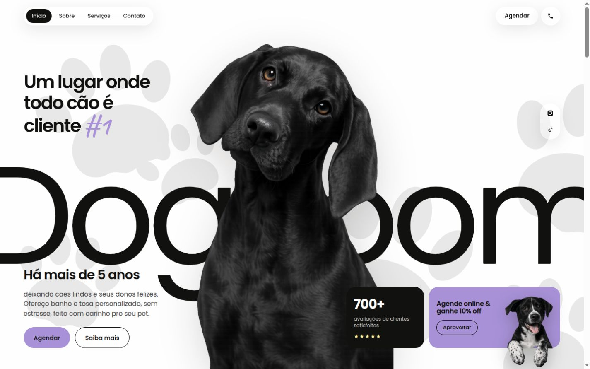

<div align="center">

# Dog Room

**Banho, tosa & carinho. Uma experiência digital feita para quem cuida de pets.**

Landing page de pet shop com identidade em preto, amarelo e lilás,
fotografia em destaque e um caminho direto até o pedido de orçamento.



</div>

## Uma página para conhecer, escolher e agendar

- **Hero responsiva** com composição própria para desktop, tablet e celular.
- **Catálogo de serviços** com consultas específicas de banho, tosa e tosa higiênica.
- **Galeria de oito fotos** em mosaico, com ampliação, setas, teclado e gesto de deslizar.
- **Pedido de orçamento** com serviço, porte e observações preparados para o WhatsApp.
- **Outdoor adaptado ao celular**, com texto legível em um painel vertical.
- Animações com GSAP, rolagem com Lenis e respeito à preferência por movimento reduzido.

## Rodar localmente

Requer Node.js 20.9 ou superior e npm.

```bash
npm ci
npm run dev
```

Abra [localhost:3000](http://localhost:3000). Para escolher outra porta:

```bash
npm run dev -- --port 3002
```

## Build de produção

```bash
npm run build
npm start
```

O build utiliza o Google Fonts para carregar Poppins e Caveat, portanto precisa
de acesso à internet na primeira compilação.

## Personalizar para uma loja

| Conteúdo | Arquivo |
| --- | --- |
| Marca, WhatsApp, telefone e Instagram | `src/core/config/site.ts` |
| Serviços, endereço e funcionamento | `src/core/config/petshop.ts` |
| Fotografias e visualizador da galeria | `src/presentation/components/sections/Gallery.tsx` |
| Cores, composição e responsividade | `src/styles/globals.css` |

Os contatos e números da hero são demonstrativos. Substitua-os pelos dados
confirmados da loja, incluindo avaliações, tempo de atuação e condições de desconto.
As fotografias ilustram o modelo e não identificam clientes ou funcionários do Dog Room.

O formulário abre o WhatsApp com a mensagem preparada. O visitante revisa e envia;
a disponibilidade e o horário são confirmados na conversa.

Mais orientações em [CONFIGURACAO.txt](CONFIGURACAO.txt).

## Tecnologias

Next.js 16 · React 19 · TypeScript · Tailwind CSS 4 · GSAP · Lenis

## Fotografias

Fotografias de banco do [Pexels](https://www.pexels.com/license/).
Os créditos e as páginas de origem estão registrados em
[serviços](public/images/editorial/sources.json) e
[galeria](public/images/gallery/sources.json).
Ao personalizar, use fotografias autorizadas da loja.
